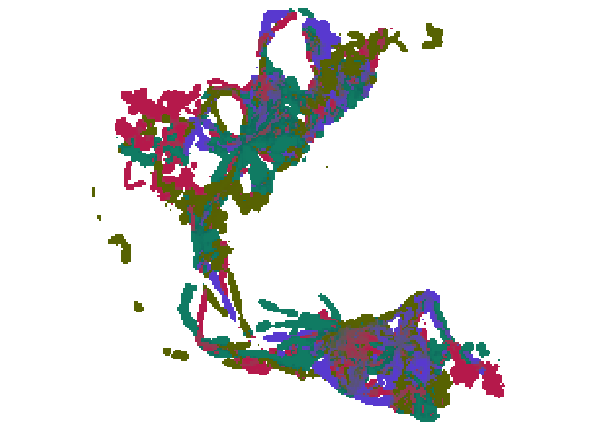

# colorist

<!-- badges: start -->

[](https://www.tidyverse.org/lifecycle/#experimental)
<!-- badges: end -->

Package description

## Installation

You can install the development version of colorist from
[GitHub](https://github.com/mstrimas/colorist) with:

``` r
# install.packages("remotes")
remotes::install_github("mstrimas/colorist")
```

## Usage

``` r
library(raster)
library(ggplot2)
library(colorist)

# load example data, elephant utlization distribution
data(elephant_ud)

# generate annual cyle metrics and a color palette
r <- annual_cycle_metrics(elephant_ud)
pal <- make_hcl_palette(elephant_ud)

# assign colors
cell_colors <- metrics_to_hex(r, pal)

# map
cols <- cell_colors$color
names(cols) <- cell_colors$color
ggplot(cell_colors) +
  aes(x = x, y = y, fill = color, alpha = alpha) +
  geom_tile() +
  scale_fill_manual(values = cols) +
  scale_alpha_continuous(trans = scales::boxcox_trans(0.15),
                         range = c(0.02, 1)) +
  guides(fill = FALSE, alpha = FALSE) + 
  coord_equal() +
  theme_void() +
  theme(panel.border = element_rect(fill = NA, color = "black"))
```


