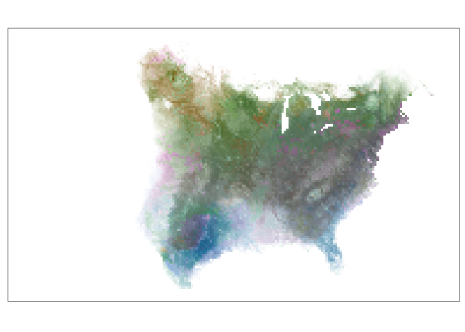

# colorist

<!-- badges: start -->

[](https://www.tidyverse.org/lifecycle/#experimental)
<!-- badges: end -->

Functions are provided for coloring and visualizing wildlife
distributions in space-time using raster data. In addition to enabling
display of sequential change in distributions through the use of small
multiples and animations, colorist provides functions for extracting
several features of interest from a sequence of distributions and for
visualizing those features using HCL (hue-chroma-luminance) color
palettes. Resulting maps allow for “fair” visual comparison of intensity
values (e.g., occurrence, abundance, or density) across space and time
and can be used to address questions about where, when, and how
consistently a species, group, or individual is likely to be found.

## Installation

You can install the development version of colorist from
[GitHub](https://github.com/mstrimas/colorist) with:

``` r
# install.packages("remotes")
remotes::install_github("mstrimas/colorist")
```

## Usage

`colorist` can be used to visualize mutliple years of distribution data
in a single map.

``` r
library(colorist)

# load example data, elephant utilization distribution
data("elephant_ud")

# generate distribution metrics
r <- metrics_distill(elephant_ud)

# generate hcl color palette
pal <- palette_timeline(elephant_ud)

# map
map_single(r, pal)
```


Alternatively, it can be used to visualize data covering different times
in a single year.

``` r
# load example data, elephant utilization distribution
data("fiespa_occ")

# generate distribution metrics
r <- metrics_distill(fiespa_occ)

# generate hcl color palette
pal <- palette_timecycle(fiespa_occ)

# map
map_single(r, pal)
```


