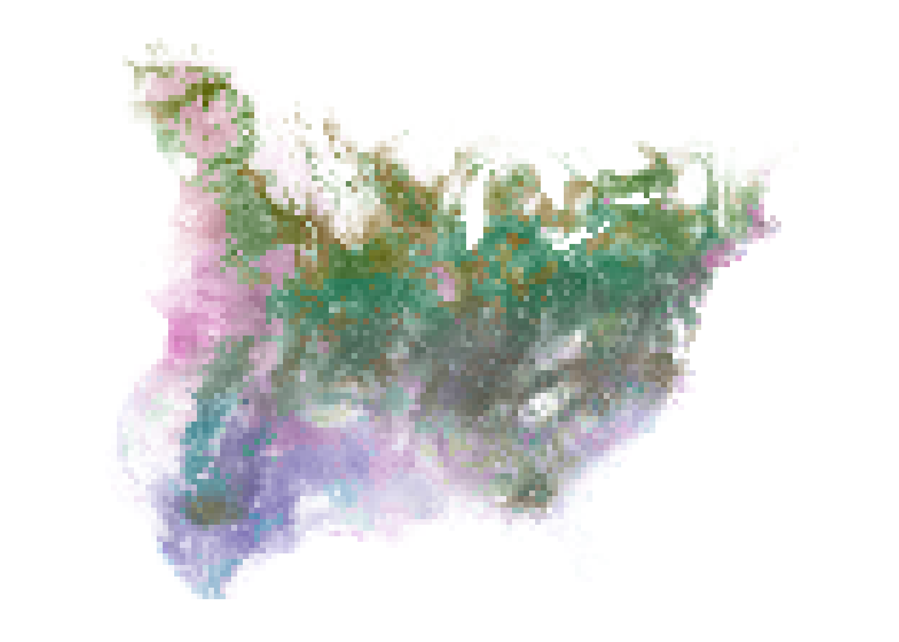

# colorist

<!-- badges: start -->

[](https://CRAN.R-project.org/package=colorist)
[](http://www.gnu.org/licenses/gpl-3.0)
[](https://www.tidyverse.org/lifecycle/#maturing)
[](https://ci.appveyor.com/project/mstrimas/colorist)
[](https://travis-ci.org/mstrimas/colorist)

<!-- badges: end -->

Maps are essential tools for communicating information about wildlife
distributions in space and time. Visualizing patterns of stasis and
change can be a challenge, however, especially when distributions
exhibit different degrees of spatial-temporal overlap. The typical
strategy of layering distributional information from different time
periods in a single map often results in occluded or muddied data,
depending on how layers are combined. `colorist` is designed to address
this challenge by providing multiple approaches to coloring and
visualizing wildlife distributions in space-time using raster data. In
addition to enabling simultaneous display of a series of distributions
through the use of small multiples, `colorist` provides functions for
extracting several features of interest from a set of distributions and
for visualizing those features using HCL (hue-chroma-luminance) color
palettes. The resulting maps allow for “fair” visual comparison of
intensity values (e.g., occurrence, abundance, or density values) across
space and time and can be used to address questions about where, when,
and how consistently a species, individual, or group is likely to be
found.

## Installation

Install `colorist` from CRAN with:

``` r
install.packages("colorist")
```

Alternatively, you can install the development version of `colorist`
from [GitHub](https://github.com/mstrimas/colorist) with:

``` r
# install.packages("remotes")
remotes::install_github("mstrimas/colorist")
```

## Background

The proliferation of tracking data and observations of wildlife
populations have enabled remarkable growth in our understanding of how
animals move through space and time. The goal of `colorist` is to help
researchers explore and communicate this information by giving them
tools to color wildlife distributions in space and time. `colorist`
contains functions to summarize three distributional features of
interest across a set of raster distributions: 1) maximum intensity
(i.e., the maximum occurrence, abundance, or density value), 2) layer of
maximum intensity (i.e., the identity of the layer containing the
maximum intensity value), and 3) specificity of the maximum intensity
value to the layer of maximum intensity (i.e., the degree to which
intensity values are unevenly distributed across layers). Each of these
metrics can be mapped to HCL (hue-chroma-luminance) colors in specific
ways to ensure that data extracted from different raster layers have
approximately equal perceptual weights in subsequent map visualizations.

## Usage

`colorist` works on raster data stored as `RasterStack` objects.
Individual raster layers might represent an ordered temporal sequence of
species distributions or utilization distributions. Alternatively,
raster layers might represent an unordered set of distributions for
multiple species, or individuals, within a single time period. Whatever
temporal or identity relationships exist within the stack, all raster
layers should contain values in the same units (e.g., abundance,
occurrence, or probability density) to ensure that they can be
meaningfully compared. The basic workflow for `colorist` is as follows:

1.  **Metrics:** Users calculate metrics to describe their
    distributions.
2.  **Color palette:** Users choose colors to describe distributions.
3.  **Map:** Users map distributions in a series of small multiples or
    in a single map.
4.  **Legend:** Users generate a legend to accompany their map.

We can demonstrate this workflow using an example dataset of monthly
Field Sparrow occurrence probability estimates from [eBird Status &
Trends](https://ebird.org/science/status-and-trends).

``` r
library(colorist)

# load example data, field sparrow occurrence probability
data("fiespa_occ")

# calculate distribution metrics
r <- metrics_distill(fiespa_occ)

# generate hcl color palette
pal <- palette_timecycle(fiespa_occ)

# map
map_single(r, pal, lambda_i = -2)
```



``` r

# legend
legend_timecycle(pal)
```


