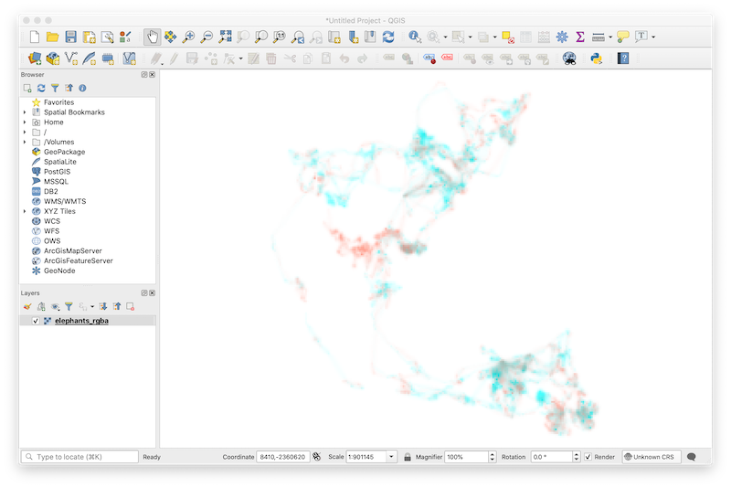

```{r, include = FALSE}
knitr::opts_chunk$set(warning = FALSE, 
                      message = FALSE,
                      collapse = TRUE,
                      comment = "#>",
                      out.width = "\\textwidth", 
                      fig.height = 4, 
                      fig.width = 7, 
                      fig.align = "center",
                      dpi = 300)
# only build vignettes locally and not for R CMD check
knitr::opts_chunk$set(eval = nzchar(Sys.getenv("BUILD_VIGNETTES")))
```

In the [Introduction to colorist](https://strimas.com/colorist/articles/introduction.html) and [Tuning visualizations in colorist](https://strimas.com/colorist/articles/tuning.html) vignettes, we provided an overview of `colorist` functionality and explored how users might adjust visualizations to address specific narrative goals. Here, we focus on several issues that users may confront when making finished visualizations: 

1. Adding context to `colorist` maps using supplementary spatial data
2. Modifying `colorist` legends
3. Displaying `colorist` maps in other R spatial packages and external GIS software

We start by loading the necessary libraries.

```{r libraries}
library(colorist)
library(ggplot2)
library(raster)
library(rnaturalearth)
library(sf)
library(tigris)
```

## 1. Adding context

It's easy to imagine users wanting to add context to visualizations generated by `colorist`, to help explain the causes of particular spatiotemporal distributions. Here, we focus on showing how Natural Earth and US Census TIGER/Line data can be accessed from within R and incorporated into `colorist` maps.  

### `rnaturalearth` package

Natural Earth is a public domain data set that contains vector and raster data developed for display at several different map scales. Files describing physical and cultural geographies can be accessed through R using functions in the `rnaturalearth` package. Here, we download Natural Earth vector data and add it to a map describing the spatiotemporal distribution of Field Sparrow, a small bird that occurs in the eastern United States. We begin by calculating distribution metrics for Field Sparrow with `metrics_distill()`, choosing a palette with `palette_timecycle()`, and creating a map with `map_single()`. Note that we choose to save the `ggplot2` map as an object.

```{r fiespa}
# calculate metrics, choose a palette, make a map
m_fiespa <- metrics_distill(fiespa_occ)
p_fiespa <- palette_timecycle(fiespa_occ)
map_fiespa <- map_single(m_fiespa, p_fiespa)
```

Then, we use the `ne_download()` function from `rnaturalearth` to download country, river, and lake spatial data as `sf` (simple features) objects, which are easy to incorporate into our existing map. In the process, we project and crop each data set to the same projection and extent as our Field Sparrow data. To avoid annoying topology and projection issues, we create our own ocean polygon by calculating the difference between a polygon describing the extent of the Field Sparrow map and the polygon describing countries.

```{r ne-downloads, results = "hide"}
# download, transform, and crop spatial data
countries <- ne_download(category = "cultural", type = "countries", 
                         returnclass = "sf", scale = 110) %>%
  st_transform(crs = st_crs(fiespa_occ)) %>%
  st_crop(st_bbox(fiespa_occ))

rivers <- ne_download(category = "physical", type = "rivers_lake_centerlines", 
                      returnclass = "sf", scale = 110) %>%
  st_transform(crs = st_crs(fiespa_occ)) %>%
  st_crop(st_bbox(fiespa_occ))

lakes <- ne_download(category = "physical", type = "lakes", returnclass = "sf", 
                     scale = 110) %>%
  st_transform(crs = st_crs(fiespa_occ)) %>%
  st_crop(st_bbox(fiespa_occ))

# create polygon describing ocean
ocean <- st_as_sfc(st_bbox(fiespa_occ)) %>%
  st_difference(st_union(countries))
```

We add the supplementary spatial data to the map by appending `geom_sf()` elements to the underlying map and symbolizing each element according to our specifications. We also add a bounding rectangle to our map.

```{r fiespa-ne}
# add supplementary spatial data to map
map_fiespa_ne <- map_fiespa +
  geom_sf(data = ocean, fill = "gray95", color = "black", size = 0.25) +
  geom_sf(data = rivers, size = 0.25, color = "gray35") +
  geom_sf(data = lakes, fill = "gray95", size = 0.25, color = "gray35") + 
  geom_sf(data = st_as_sfc(st_bbox(fiespa_occ)), fill = NA, color = "black", 
          size = 0.25) 

# show the map
print(map_fiespa_ne)
```

Now, we have a clearer perspective on the spatiotemporal distribution of Field Sparrow in relation to a variety of easily recognizable geographic features in North America.

### `tigris` package

Next, we integrate spatial data from the `tigris` package into a map describing Fisher use of a territory in upstate New York over the course of nine nights. The `tigris` package enables download of TIGER/Line data generated by the United States Census Bureau. Files detail a wide array of geographic features, area delineations, and place names throughout the United States. 

In contrast to the previous example, we start by using the `metrics_pull()`, `palette_timeline()`, and `map_multiples()` functions to visualize individual raster layers from the Fisher data set. We adjust `lambda_i` within `map_multiples()` to emphasize areas that were used only briefly by the Fisher.

```{r fisher-multiples}
# calculate metrics, choose a palette, make a series of maps
m_fisher <- metrics_pull(fisher_ud)
p_fisher <- palette_timeline(9, start_hue = -40)
map_fisher <- map_multiples(m_fisher, p_fisher, lambda_i = -5, 
                            labels = paste("April", 7:15))
```

To download spatial data using `tigris` we need to know that the Fisher study area is located in Rensselaer County, New York. Then, we can access linear water features, areal water features, and roads for the county using `tigris` functions, projecting and cropping our supplementary spatial data along the way. `tigris` functions provide data formatted as `sf` objects.

```{r tigris-download, results="hide"}
# download, transform, and crop spatial data
streams <- linear_water("NY", "Rensselaer") %>%
  st_transform(crs = st_crs(fisher_ud)) %>%
  st_crop(st_bbox(fisher_ud))

ponds <- area_water("NY", "Rensselaer") %>%
  st_transform(crs = st_crs(fisher_ud)) %>%
  st_crop(st_bbox(fisher_ud))

roads <- roads("NY", "Rensselaer") %>%
  st_transform(crs = st_crs(fisher_ud)) %>%
  st_crop(st_bbox(fisher_ud))
```

As in the previous example, we add our spatial data to the underlying `colorist` map using `geom_sf()` elements and we add an unobtrusive bounding box to more clearly define the facets of our plot.

```{r fisher-multiples-tigris, fig.height=6}
# add supplementary spatial data to the series of maps
map_fisher + 
  geom_sf(data = streams, linetype = 6, color = "lightblue4", size = 0.25) +
  geom_sf(data = ponds, linetype = 6, color = "lightblue4", fill = "lightblue", 
          size = 0.25) +
  geom_sf(data = roads, size = 0.25, color = alpha("black", 0.5)) +
  geom_sf(data = st_as_sfc(st_bbox(fisher_ud)), fill = NA, color = "gray", 
          size = 0.25)
```

Now we can clearly see how the Fisher moved throughout its territory across nights and in relation to the locations of roads, streams, and ponds.

### General comments

We recommend trying to keep a “light touch” with edits to `colorist` maps to ensure that information about spatiotemporal distributions remains the focus. In addition, it's important to keep in mind that `colorist` visualizations rely on differences in cell opacity to communicate information about differences in intensity; changing the plot background color from white will make the map difficult to interpret.

## 2. Modifying legends

The legend functions in `colorist` generate `ggplot2` plot objects, some of which are fairly complicated. Here, we focus on modifying legends to aid interpretation and combining legends and maps within a `ggplot2` framework.

### `legend_timecyle()`

When we make a legend for the Field Sparrow annual cycle map described above, the default settings do not communicate the meanings of intensity, specificity, or layer very clearly. 

```{r fiespa-legend}
# create a legend using default settings
legend_timecycle(p_fiespa)
```

Remember, we have distilled distribution metrics from a stack of monthly occurrence probabilities, so intensity values represent maximum occurrence throughout the year, specificity values indicate the degree of seasonality in occurrences, and layer values reveal the month of maximum occurrence. We can edit the legend to clarify these interpretations by making several changes in the `legend_timecycle()` function.

```{r fiespa-legend-custom}
# change labels on legend
l_fiespa <- legend_timecycle(p_fiespa, 
                             origin_label = "Jan 1",
                             # specificity labels
                             label_s = c("Low\nseasonality", 
                                         "Moderate\nseasonality", 
                                         "High\nseasonality"), 
                             # intensity label
                             label_i = "Peak occurrence", 
                             # layers label
                             label_l = "Month of peak occurrence")

# show legend
print(l_fiespa)
```

Better. 

Now, we need to decide where to position the legend in relation to the map describing the spatiotemporal distribution of Field Sparrow. After playing with several ideas, we place the legend beneath the main map. This requires expanding the spatial extent of the plot using the `coord_sf()` function and then inserting the legend into the “empty landscape” using `annotation_custom()`. Note that the values in `coord_sf()` and `annotation_custom()` are in projected map coordinates.

```{r fiespa-map, fig.height = 7, fig.width = 7}
# position legend below map
map_fiespa_ne +
  coord_sf(ylim = c(-3153281, 1405830)) +
  annotation_custom(ggplotGrob(l_fiespa), 
                    xmin = -1482551, xmax = 1850606, 
                    ymin = -3153281, ymax = -1453281)
```

### `legend_timeline()`

The strategy for editing details of `legend_timeline()` plots is similar to that for `legend_timecycle()` plots, despite differences in their layouts. Before changing the legend, however, we should use `metrics_distill()` and `map_single()` to describe Fisher use of its territory over nine nights in a single map. Because we're making one larger map, we're also going to add another layer of spatial data describing building footprints in the area. These features come from the [OpenStreeMap Microsoft Building Footprint](https://wiki.openstreetmap.org/wiki/Microsoft_Building_Footprint_Data) dataset, a cropped and projected copy of which is [available on the GitHub repository](https://github.com/mstrimas/colorist/blob/master/data-raw/buildings.rds) for this package.

```{r fisher-single}
# calculate distribution metrics  
m_fisher_distill <- metrics_distill(fisher_ud)

# download building footprints
f_buildings <- file.path(tempdir(), "buildings.rds")
download.file(paste0("https://github.com/mstrimas/colorist/raw/master/",
                     "data-raw/buildings.rds"),
              f_buildings)
buildings <- readRDS(f_buildings)
unlink(f_buildings)

# make a map
map_fisher_distill <- map_single(m_fisher_distill, p_fisher, 
                                 lambda_i = -5, lambda_s = 10) +
  geom_sf(data = streams, linetype = 6, color = "lightblue4", size = 0.25) +
  geom_sf(data = ponds, linetype = 6, color = "lightblue4", fill = "lightblue", 
          size = 0.25) +
  geom_sf(data = roads, size = 0.25, color = alpha("black", 0.5)) +
  geom_sf(data = buildings, size = 0.25, color = alpha("black", 0.5)) +
  geom_sf(data = st_as_sfc(st_bbox(fisher_ud)), fill = NA, color = "black", 
          size = 0.25)

# show the map
print(map_fisher_distill)
```

Setting `lambda_i = -5` makes rarely used parts of the landscape more conspicuous and setting `lambda_s = 10` emphasizes differences in how consistently areas were used across nights. Spatial data for Rensselaer County are added to the map using `geom_sf()` elements, just as in the previous section.

Now, let us generate a default legend for our Fisher data using `legend_timeline()`.

```{r fisher-legend}
# create a legend using default settings
legend_timeline(p_fisher)
```

To make the legend more helpful as a guide to interpreting the spatiotemporal distribution of the Fisher, we need to edit intensity, specificity, and layer labels. So, we modify `label_s`, `label_i`, and `label_l` in `legend_timeline()` to reflect their meanings with respect to the Fisher data. We also prescribe how the ends of the timeline are labeled using the`time_labels` argument.

```{r fisher-legend-custom}
# change labels of legend
l_fisher <- legend_timeline(p_fisher, 
                            time_labels = c("Apr 7", "Apr 15"),
                            # intensity label
                            label_i = "Peak use", 
                            # layer label
                            label_l = "Night of peak use",
                            # specificity labels
                            label_s = c("Consistent use", "Occasional use", "Ephemeral use")) 

# show legend
print(l_fisher)
```

To place our legend next to the map, we expand the extent of our plot by modifying `coord_sf()` and we specify its position using the `annotation_custom()` function.

```{r map-fisher, fig.width=8, fig.height=8}
# position legend to the left of the map
map_fisher_distill +
  coord_sf(xlim = c(-4300, 2150)) +
  annotation_custom(ggplotGrob(l_fisher), 
                    xmin = -4400, xmax = -2500, 
                    ymin = 5100266, ymax = 5104666) 
```

### `legend_set()`

Here, we return to data describing the utilization distributions of two African Elephants in Etosha National Park in 2011. The two layers of the RasterStack form an unordered set of distributions, one for each individual. To visualize how the elephants partitioned space, we begin by calculating distribution metrics using `metrics_distill()`, creating a palette with `palette_set()`, and generating a map with `map_single()`. We add visual emphasis to rarely used areas via the `lambda_i` argument.

```{r elephants}
# calculate metrics, choose a palette, make a series of maps
m_elephants <- metrics_distill(elephant_ud)
p_elephants <- palette_set(elephant_ud)
map_elephants <- map_single(m_elephants, p_elephants, lambda_i = -5)
```

This should all seem familiar. 

Next, we build a legend using our palette and the default settings in `legend_set()`.

```{r elephants-legend}
# create a legend using default settings
legend_set(p_elephants)
```

The legend is meant to tell us how the two individuals partitioned space in Etosha National Park over the course of a year, allowing viewers to understand locations that were used predominantly by one individual, or the other, and locations that were used equally by both individuals. 

To help communicate this information more clearly, we should make some adjustments to the legend. We can label the two facets with individual identifiers using the `group_labels` argument in `legend_set()` and we can modify`label_i`,`label_s`, and `axis_s` values to orient viewers. 

```{r elephant-legend-custom}
# change labels of legend
l_elephants <- legend_set(p_elephants, 
                          group_labels = names(elephant_ud),
                          # intensity label
                          label_i = "Intensity of use",
                          # specificity label
                          label_s = "Share of use",
                          # specificty axis
                          axis_s = c("equal", "sole"))

# show legend
print(l_elephants)
```

Now, we have a legend that further reveals the narrative of space use by LA11 and LA14 in 2011 and we can position it within the map using `annotation_custom()`. 

```{r elephants-map, fig.width=8, fig.height=6}
# position legend within map
map_elephants +
  annotation_custom(ggplotGrob(l_elephants), 
                    xmin = -3000, xmax = 37000, 
                    ymin = -2347500, ymax = -2305000)
```

## 3. Displaying `colorist` maps in other software

`colorist` uses `ggplot2` to construct visualizations because it is an incredibly flexible visualization tool that enables maps and legends to be amended and adjusted in many different ways. However, some users may want to employ other tools for visualizing `colorist` outputs, because of their greater familiarity with those tools or because of specific features that are not available in `colorist` or `ggplot2`. 

Many of the R packages that enable plotting of spatial data (and most external GIS software) rely on RGBa descriptions of color and opacity instead of the hexadecimal-alpha descriptions used in `colorist` functions. To accommodate display of `colorist` maps in these other tools, the `map_single()` function can be used to return a `RasterStack` object containing layers of red, green, blue, and alpha information. Users can then visualize those data in a variety of other tools.

### `raster` package

The `raster` package is a workhorse for handling and analyzing gridded spatial data in R. Here, we return to our Field Sparrow data, but instead of accepting the default `colorist` map output, we specify `return_type = "stack"` in the `map_single()` function. This change directs `map_single()` to return an RGBa stack instead of a `ggplot2` plot object. 

```{r fiespa-rgban}
# ask for map as a raster stack
s_fiesp <- map_single(m_fiespa, p_fiespa, return_type = "stack")

# show stack information
s_fiesp
```

With a `RasterStack` describing our map in RGBa values, we can now opt to visualize the data using plot functions available in the `raster` package. The standard `raster::plot()` function illustrates each layer of the RasterStack in a standard color palette. In addition to the R, G, B, and alpha layers, note the last layer (i.e., `n_layers`) which describes, in every cell, the number of layers in the original `fiespa_occ` data set containing non-NA occurrence values.

```{r fiespa-rgban-raster}
# plot layers using raster plot function
plot(s_fiesp)
```

To reconstruct our `colorist` map with the appropriate color scheme, we visualize the stack using `raster::plotRGB()`, which requires specification of R, G, and B layers. It also requires specification of alpha values as a vector. If all has gone well, the resulting plot should look the same as the `ggplot2` plot generated within `colorist`.

```{r fiespa-rgban-map}
# plot r, g, b, and alpha layers to reconstruct colorist map
plotRGB(s_fiesp, 1, 2, 3, alpha = as.vector(s_fiesp[["alpha"]]))
```

You can then add supplementary spatial data to your raster using other plot functions within `raster` and related packages.

### QGIS

There are situations in which you may want to use external GIS software instead of R to create a refined cartographic visualization of `colorist` output. Here, we show how to recreate `colorist` maps in QGIS, a powerful and free GIS.

Here, we reuse metrics and palette information that we have already generated for two African Elephants to create a map. Instead of accepting the default settings in the `map_single()` function, however, we specify `return_type = "stack"` and save the output as a `RasterStack`. 

```{r elephants-rgban-qgis, eval = FALSE}
# ask for map as a RasterStack object
s_elephants <- map_single(m_elephants, p_elephants, lambda_i = -5, 
                          return_type = "stack")

# save RasterStack to R working directory
writeRaster(s_elephants, "elephants_rgba.grd")
```

Then, we drag the resulting file into an empty QGIS workspace to begin the visualization process. 



The default symbology assigned to the multiband raster by QGIS makes it appear as if our map were created using a box of pastels. To correct the appearance of the map colors, double-click on the elephant_rgba layer to open Layer Properties and ensure that data are being rendered in multiband color, RGB bands are in the correct order, and min and max values for all three bands are 0 and 255, respectively. In addition, be sure that band 4 (i.e., alpha) is specified as the transparency band in the Transparency tab of Layer Properties.


After clicking Apply, the thumbnail at the base of the layer properties interface should correctly reproduce the map we were able to generate in R. Click OK. Avoid making further changes to the symbology of elephant_rgba, otherwise map colors will not match those generated in the `colorist` palette and the map will become difficult to interpret. Now, users can add and symbolize spatial data using sophisticated cartographic tools available within QGIS. 
